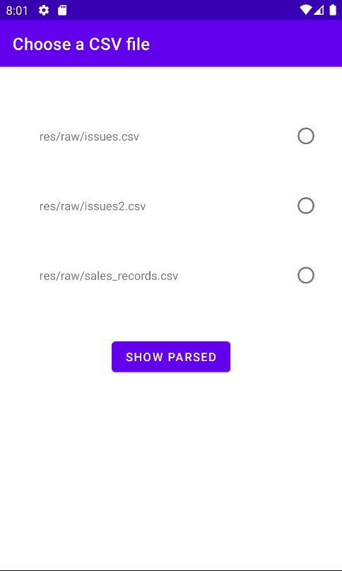
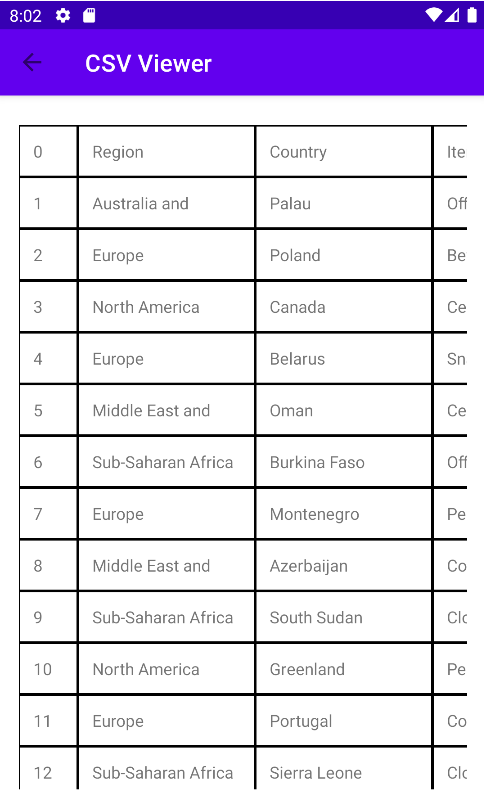
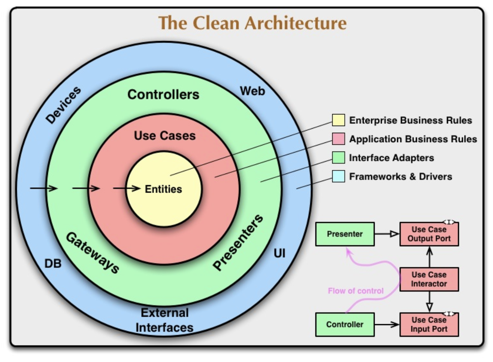

## Functional requirements

    Operate with the application is simple, on the first screen we find the selection of the CSV file,
    in order to facilitate the possibility of more CSV files to the list, simply add it in res/raw.
    
    The application is ready to read files regardless of their size without this affecting their well working.

    Once the file has been added and the compilation has been done, click on the file that you want to parse and
    click on the "SHOW PARSED" button

    

    Finally we can see the parsed CSV, being able to explore its content in tabular way.

## How architecture is built

    It has been chosen Clean Architecture with MVVM, this decision has been taken since this is a technical test, because it is
    a complex architecture thought for medium and large applications, for an application of this type the appropriate thing would be
    simply to use MVVM, MVP or MVI.

    We have all three layers defined in Clean Architecture (presentation, domain, and data), but unlike the
    traditional approach of split them into packages or modules, the relationships are done at the class relationship level to maximize
    productivity in development, avoiding boilerplates and taking all advantages of Kotlin.

    Inside the "core" package are the base classes, which are transversal over the code and let say that it is where 
    the definition of the architecture is defined.

    In the package "features" the features of the application would be added, each feature consists of at least:
        * Presentation layer (Fragments -> ViewModel [LiveData/Flow]) uses view objects
        * Domain layer (Use cases -> Repository) uses domain objects
        * Data layer (Network / Database / Filesystem / Memory ) uses data transfer objects

## What features does the project have?

     * Separation by layers, the inner layers do not know about the outer layers
     * Dependency injection and dependency inversion: Depend on abstractions and not on concretions.
     * Functional programming: Using Either to avoid the traditional try/catch approach and avoid flow controls that is a mess prone to problems.
     * Batch reading of the file: Using Pagging 3
     * Architecture Components: ViewModel, Lifecycle, LiveData y Navigation Paging
     * Encapsulation of platform details to ease migration to iOS using KMM
     * Organized way for mantaining gradle libraries and version updates

## Problems I faced

    Mainly the problem has been reading huge CSV files, for solve it I first thought in a more creative approach:
    RecycleView makes it easy for us with the built-in ViewHolder pattern to load into memory only what the user is
    seeing, the problem is that it always hangs on a collection, the collection cannot be a complete CSV because also
    it would overflow the memory, therefore, the adapter would have to be customized to accept streams, this is not trivial
    since the Adapter needs to override the getItemCount method. To do this, a first reading can be done by counting
    the number of lines of the CSV and the header, in such a way that we can get the number of columns as well. The stream can consist
    in reading the position that the onBindViewHolder method requests, in addition, to improve efficiency we can take advantage of 
    the request, reading for saving in memory some previous and forward positions knowing that the user from the UI
    will normally do sequential reads.

    Second approach: delegate to Jetpack Pagging 3 the use of in-memory paging, this approach has the main advantage
    that it is not necessary to maintain too much custom code, on the other hand, the use of a standard library allows
    easily collaborate with other developers without the cognitive load of having to understand particularities of
    the first approximation.

    The first approach can be seen in the "csv_batches_approach" branch, its efficiency is as good as Pagging 3, but
    the second one was chosen for the reasons already explained above.

## Testing

    The main functionalities of the application have been tested, I would have liked cover 100% of the code, however, for avoiding
    making this technical test excessively long, I decided to make instrumental and unit tests of the key functionalities also 
    trying to have a variety since the most important purpose in my humble opinion is to show that I able to perform them.